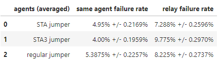
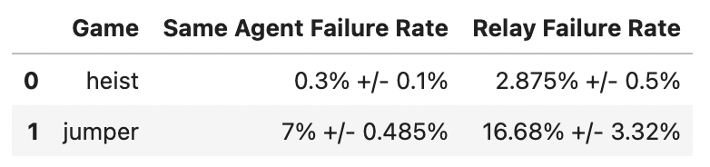

# computational machine learning lab

### notes to self:
* nohup.out is relay failure/generalization for ppo jumper agents
* nohup2.out is regular failure/generalization for ppo jumper agents
* nohup3.out is relay failure/generalization for ppo heist agents
* nohup4.out is regular failure/generalization for ppo heist agents
* a faster way to evaluate these metrics would be to terminate the environment after 500 steps instead of the default 1000 

* nohup50.out is same agent failure rates on jumper with the redfined successes/failures (reevaluation)
* nohup51.out is the relay failure rates for jumper with the redefined successes/failures (reevaluation)

* nohup100.out 200m step STA same agent failures
* nohup101.out 200m step STA3 same agent failures
* nohup200.out: 200m step STA agent relay failures on regular jumper agents
* nohup201.out: 200m step STA3 agent relay failures on regular jumper agents

* returns of 200m STA and STA3 are being evaluated on valla, need to reevaluate returns for regular jumper agents as well for 1000 steps instead of 100 for more accurate metrics

### sta metrics:

### same agent vs relay failure rates

